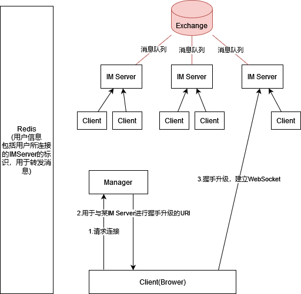

### 整体架构

* 使用Spring作为Ioc容器
* Netty处理网络通信
* Redis储存用户信息
* RabbitMQ在不同IM服务器之间转发消息

### Design & Problem:
* **使用消息队列在服务器之间传输消息是否合理?**
* 对象模型:
  * Request <-extend- AuthRequest , MessageRequesst
  * MessageRequest 包含 Map<String, Object> 作为message body
  * **暂未验证MessageRequest中的message body 是否与 messageType标识的类型匹配!**
  * Mybatis TypeHandler处理Map<String, Object> <-> JSON
* ConnectionContext - 使用ThreadLocal储存当前用户和连接，供service层业务代码使用（参照SpringSecurity的SecurityContext）
* 
### 优化计划:
* 尝试异步执行持久化，不阻塞消息的转发，减小延时
* **改用protocol**
* **更合理的模型**